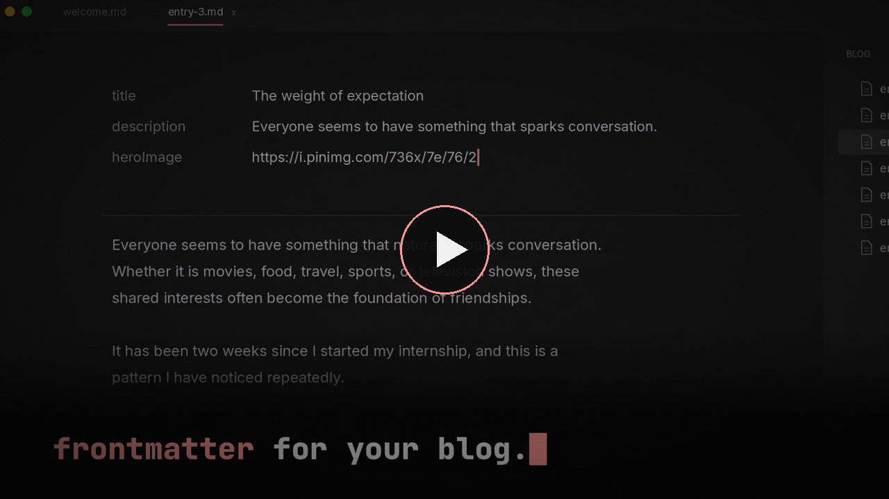

# nuza-web 
source code for the nuza landing page, built with astro and tailwind.

commands:
- `bun install` to install dependencies
- `bun dev` to start dev server
- `bun build` to build for production
